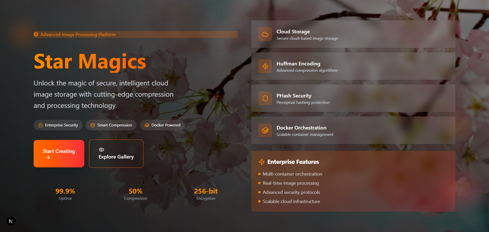
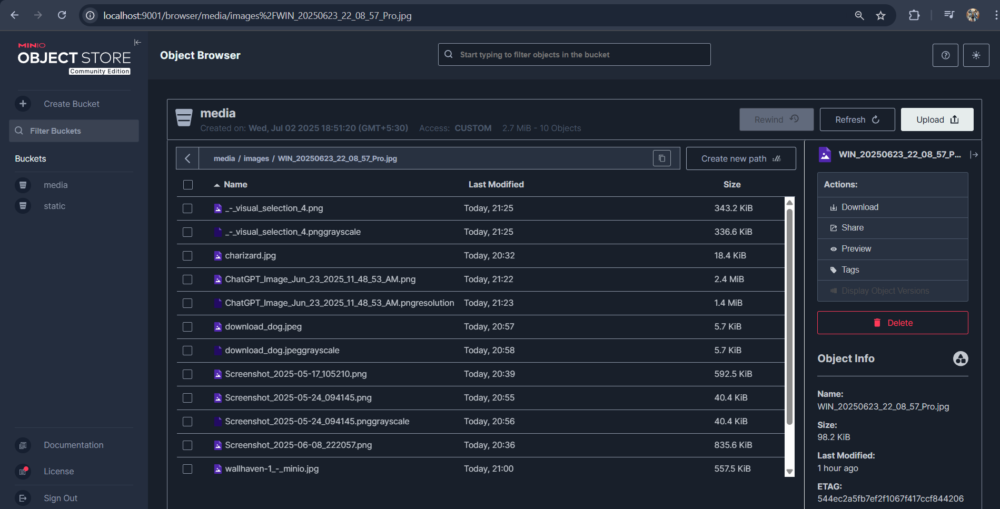
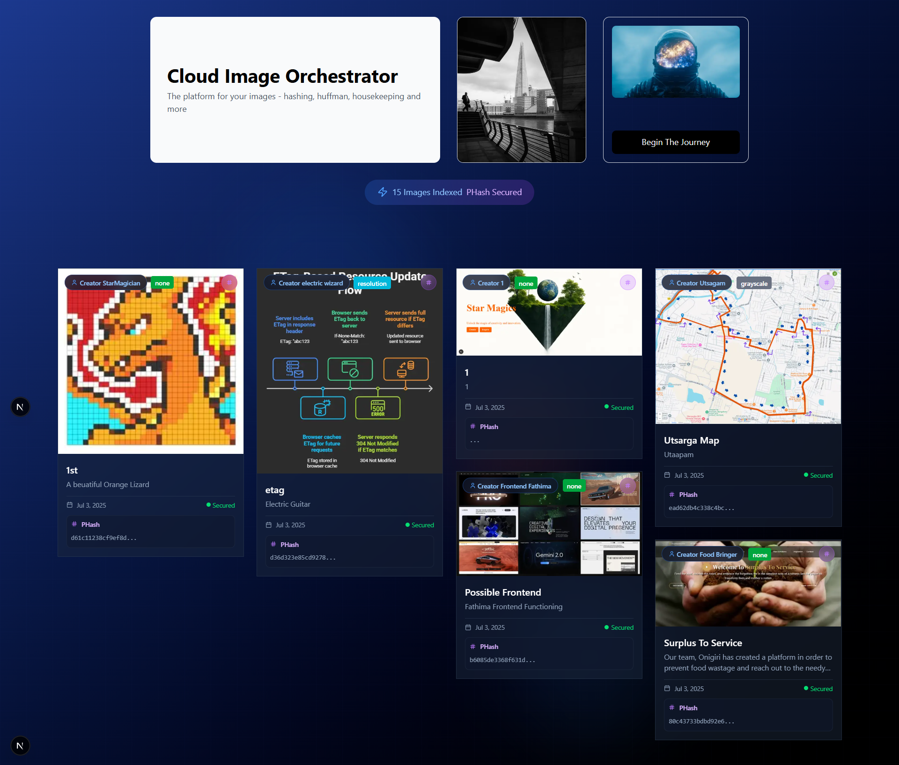
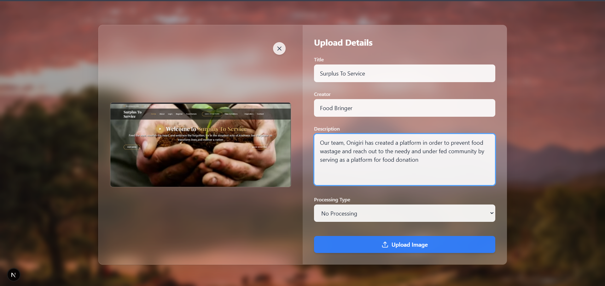
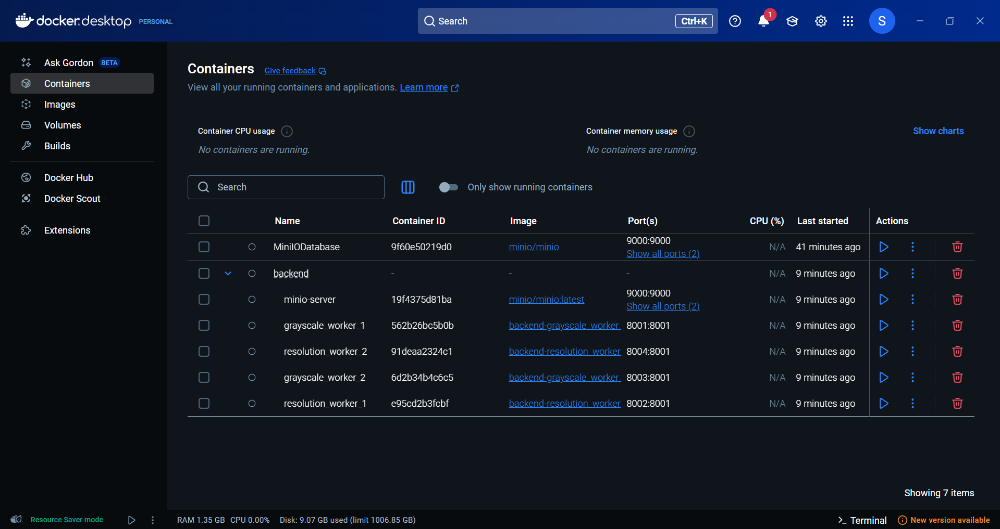
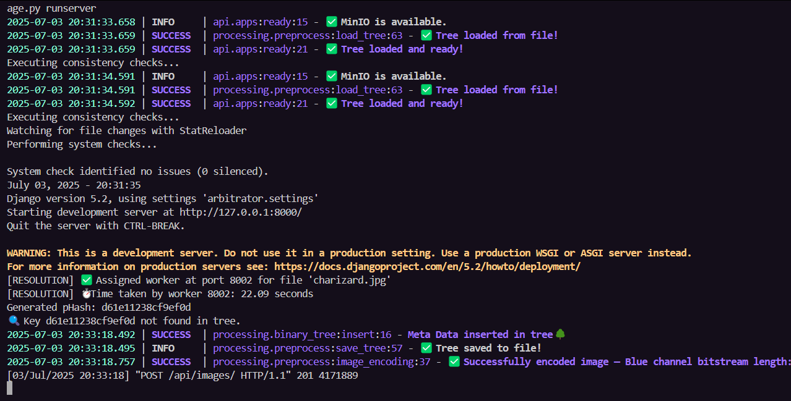
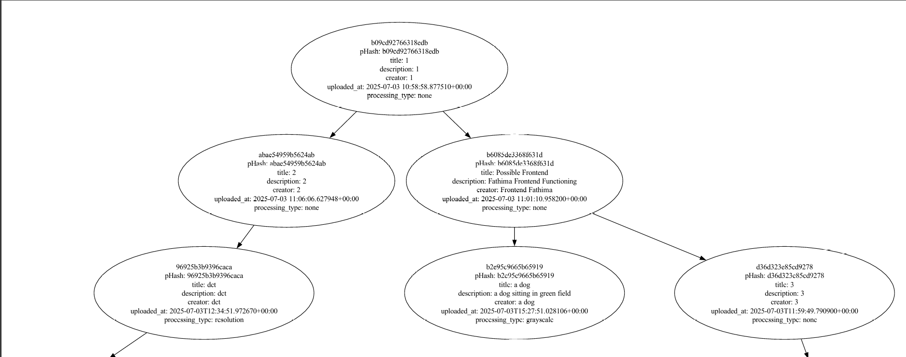

---

# 📸 Image Cloud Storage Platform
> *Image: Home page of the platform*

 

A full-stack project for 4th semester DAA, featuring:
- Django REST backend with MinIO object storage
- Next.js frontend
- Huffman encoding, perceptual hashing, and binary search tree for image deduplication
- Distributed image processing with Dockerized workers

---

## Table of Contentsl

1. [Project Overview](#project-overview)
2. [Architecture](#architecture)
3. [Backend Setup (Django + MinIO)](#backend-setup)
4. [Frontend Setup (Next.js)](#frontend-setup)
5. [Dockerized Workers](#dockerized-workers)
6. [Running the Full Stack](#running-the-full-stack)
7. [Graphviz & Visualization](#graphviz--visualization)
8. [References](#references)
9. [Troubleshooting](#troubleshooting)

---

## Project Overview


This project is a cloud image storage platform with advanced deduplication and distributed processing. Users can upload images, which are hashed, encoded, and stored efficiently. Processing requests (like grayscale or resolution change) are handled by Dockerized worker containers.

---

## Architecture


- **Backend:** Django REST API, MinIO for object storage, BST for hash lookup, Huffman encoding for compression.
- **Frontend:** Next.js app for user interaction.
- **Workers:** Docker containers for image processing tasks.
- **Visualization:** Graphviz for BST visualization.

---

## Backend Setup

### 1. Clone the Repository

```bash
git clone https://github.com/Sri-Ram-A/DAA_Photo
cd photo_daa/backend
```

### 2. Create and Activate Virtual Environment

```bash
python -m venv venv
venv\Scripts\activate  # On Windows
# OR
source venv/bin/activate  # On Linux/Mac
```

### 3. Install Python Dependencies

```bash
pip install -r requirements.txt
```

### 4. Install & Run MinIO (Object Storage)

#### Option 1: Docker (Recommended-Done by us)

```bash
docker run --name "MiniIODatabase" -p 9000:9000 -p 9001:9001 quay.io/minio/minio server /data --console-address ":9001"
```

#### Option 2: Manual Download

- Download from: https://min.io/download#/windows
- Run as per instructions.

> 
>
> *Image: MinIO web interface at localhost:9001*

### 5. Django Configuration

- Ensure `django_minio_backend` is in `INSTALLED_APPS` (see `backend/arbitrator/settings.py`).
- If you get errors about buckets, delete the `backend/api/migrations/` folder and re-run migrations:

```bash
python manage.py makemigrations api
python manage.py migrate
```

### 6. Run the Backend Server

```bash
python manage.py runserver
```


---

## Frontend Setup

### 1. Go to Frontend Directory

```bash
cd ../frontend
```

### 2. Install Node.js Dependencies

```bash
npm install
```

### 3. Start the Next.js Development Server

```bash
npm run dev
```

- The app will be available at [http://localhost:3000](http://localhost:3000).

> 
>
> *Image: Image upload page*

---

## Dockerized Workers

Workers handle image processing tasks in parallel.

### 1. Build and Start All Containers

From the `backend/` directory:

```bash
docker-compose up --build
```

- This will start MinIO and all worker containers.
- You can check running containers with:

```bash
docker ps
```

> 
>
> *Image: Docker containers running*

---

## Running the Full Stack

1. **Start MinIO** (if not using Docker Compose, see above).
2. **Start Django backend** (`python manage.py runserver`).
3. **Start Docker workers** (`docker-compose up --build`).
4. **Start Next.js frontend** (`npm run dev` in `frontend/app`).

---

# 🌳 Graphviz Installation & Setup Guide

Graphviz is a powerful graph visualization software used to generate diagrams (like trees, flowcharts, etc.). In our project, we use it to visualize the binary search tree storing image hashes and metadata.

---

## 💻 Windows

### ✅ Install Graphviz system package

1. Download the Graphviz installer from the official site:
   👉 [Graphviz Download - Windows](https://graphviz.org/download/#windows)

2. Run the installer. **Important:**
   ✅ During installation, **check the option** `Add Graphviz to the system PATH`.
   This allows you to use Graphviz commands globally.

3. Once installed, open a new **Command Prompt (cmd)** or **PowerShell**, and run:

   ```bash
   dot -V
   ```

   You should see a version message like:

   ```
   dot - graphviz version 2.50.0 (20211204.2003)
   ```

   🎉 Done!

---

## 🍏 macOS

### ✅ Install using Homebrew

1. Install Homebrew if you haven't yet:

   ```bash
   /bin/bash -c "$(curl -fsSL https://raw.githubusercontent.com/Homebrew/install/HEAD/install.sh)"
   ```

2. Install Graphviz:

   ```bash
   brew install graphviz
   ```

3. Check installation:

   ```bash
   dot -V
   ```

   If you see the version output, you're good to go!

---

## 🐧 Linux (Ubuntu / Debian)

### ✅ Install via apt

1. Update your package list:

   ```bash
   sudo apt update
   ```

2. Install Graphviz:

   ```bash
   sudo apt install graphviz
   ```

3. Verify:

   ```bash
   dot -V
   ```

---

## 🐍 Install Python package (common step)

Regardless of OS, install the Python wrapper:

```bash
pip install graphviz
```

This package lets you use Graphviz in Python code to generate and render diagrams.

---

## ✅ Test it!

Here’s a minimal Python snippet to check that everything works end-to-end:

```python
from graphviz import Digraph

dot = Digraph(comment="Test Graph")
dot.node('A', 'Start')
dot.node('B', 'End')
dot.edge('A', 'B', 'Go')

dot.render('test_graph', format='pdf', view=True)
```

* This will generate a file `test_graph.pdf` and open it (if `view=True`).
* You should see a small graph with two nodes, "Start" and "End", connected by an edge labeled "Go".

---

## ⚡ Troubleshooting

* **dot: command not found?**

  * On Windows: Ensure Graphviz `bin` folder is in your `PATH`. Restart your terminal after install.
  * On macOS/Linux: Check that `/usr/local/bin` (or wherever brew/apt installs) is in your PATH.

> 
>
> *Image: BST visualization generated by Graphviz*

---

## References

- [Django REST Framework](https://www.django-rest-framework.org/)
- [django-minio-backend](https://pypi.org/project/django-minio-backend/)
- [MinIO](https://min.io/)
- [Next.js](https://nextjs.org/)
- [Graphviz](https://graphviz.org/)
- [Docker Compose](https://docs.docker.com/compose/)
- [Huffman Coding](https://en.wikipedia.org/wiki/Huffman_coding)
- [Perceptual Hashing](https://www.hackerfactor.com/blog/index.php?/archives/432-Looks-Like-It.html)

---

## Troubleshooting

- **MinIO bucket error:**  
  _"The configured bucket (media) must be declared..."_  
  → Delete `backend/api/migrations/`, re-run migrations, and ensure MinIO is running.

- **Graphviz not found:**  
  Ensure Graphviz is installed and its `bin` directory is in your system PATH.  
  Test with `dot -V` in your terminal.

- **Docker issues:**  
  Make sure Docker Desktop is running and you have permission to run containers.

---


## Want to Contribute?

Feel free to fork, open issues, or submit pull requests!

---


## Contributors
- [Sreeharish TJ](https://github.com/TJSreeharish)
- [SriRam.A](https://github.com/Sri-Ram-A)
- [Zaid Sharieff](https://github.com/Zxid-Shxrieff)
- [Sirikumar CS](https://github.com/siriaanya129)
