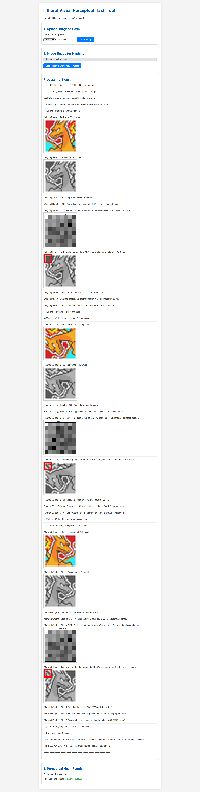

# Perceptual Hash Flask Demo

This directory contains a Flask web app to demonstrate robust perceptual hashing (pHash) for images, with step-by-step educational visualization.

---


> `Web UI`
 

---
## Features
- Upload an image and see how its perceptual hash is computed
- Visualizes each step: resizing, grayscale, DCT, binarization, and hash construction
- Handles different orientations (original, rotated, mirrored) for robust hashing
- Educational logs and intermediate images for learning

---

## Setup Instructions

### 1. Create and Activate a Virtual Environment (Recommended)

```bash
python -m venv venv
# On Windows:
venv\Scripts\activate
# On Linux/Mac:
source venv/bin/activate
```

### 2. Install Dependencies

```bash
pip install flask pillow numpy scipy matplotlib werkzeug
```

### 3. Run the Flask App

```bash
python app.py
```

- The app will be available at: [http://127.0.0.1:5000](http://127.0.0.1:5000)

---

## Usage

1. Open the web app in your browser.
2. Upload an image (supported formats: PNG, JPG, JPEG, GIF, BMP, WEBP).
3. Click to obtain the perceptual hash.
4. View the step-by-step process and intermediate images.

---

## Directory Structure

- `app.py` — Main Flask application
- `templates/index.html` — Web UI
- `uploads/` — Uploaded images (auto-created)
- `uploads/temp_step_images/` — Temporary images for step-by-step visualization (auto-created)

---

## Troubleshooting

- **Port already in use:** Change the port in `app.py` or stop the other process.
- **Large images:** Max upload size is 16MB by default.
- **Missing dependencies:** Double-check the `pip install` step.

---

## References
- [Flask Documentation](https://flask.palletsprojects.com/)
- [Pillow (PIL) Docs](https://pillow.readthedocs.io/)
- [Perceptual Hashing (pHash)](https://www.hackerfactor.com/blog/index.php?/archives/432-Looks-Like-It.html)

---


## License
For educational/demo use only.
